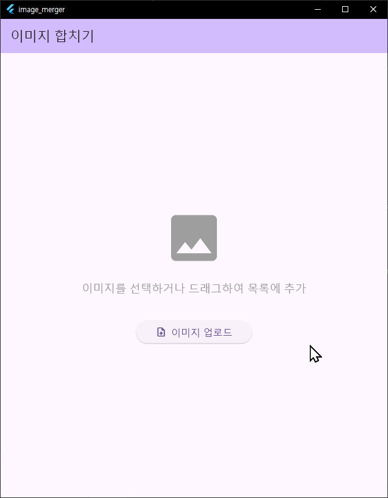
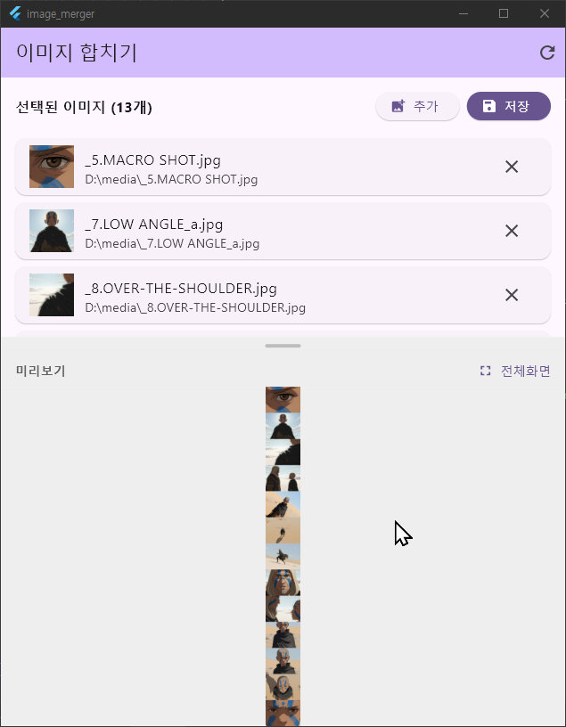
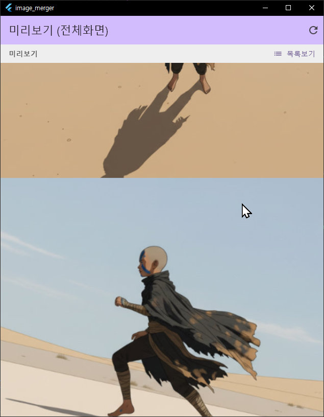

# 🖼️ Image Merger - 이미지 합치기 앱

Flutter로 만든 Windows용 이미지 세로 합치기 앱입니다. 여러 이미지를 선택하면 자동으로 세로로 합쳐서 하나의 이미지로 만들어줍니다.





## ✨ 주요 기능

- 🎯 **드래그 앤 드롭**: 파일 탐색기에서 이미지를 드래그하여 앱에 드롭
- 📐 **자동 세로 합치기**: 선택한 이미지들을 순서대로 세로로 합침
- 🔍 **확대/축소**: 마우스 휠로 이미지 확대/축소 (최대 800%)
- 🖱️ **드래그 스크롤**: 마우스로 클릭 & 드래그하여 이미지 이동
- 💾 **저장 경로 기억**: 한 번 선택한 저장 경로를 기억해서 다음에도 사용

---

## 🚀 시작하기 (Flutter 처음이신 분들을 위한 가이드)

### 1단계: Flutter 설치하기

#### Windows 사용자
1. **Flutter SDK 다운로드**
   - https://docs.flutter.dev/get-started/install/windows 방문
   - "Get the Flutter SDK" 섹션에서 최신 버전 다운로드
   - 다운로드한 ZIP 파일을 `C:\src\flutter` 같은 곳에 압축 해제

2. **환경 변수 설정**
   - Windows 검색에서 "환경 변수" 입력
   - "시스템 환경 변수 편집" 클릭
   - "환경 변수..." 버튼 클릭
   - "사용자 변수"에서 `Path` 선택 후 "편집" 클릭
   - "새로 만들기"를 클릭하고 `C:\src\flutter\bin` 추가 (압축 해제한 위치에 맞게 수정)
   - 확인을 눌러 모든 창 닫기

3. **설치 확인**
   ```powershell
   # PowerShell 또는 명령 프롬프트를 새로 열고 실행
   flutter --version
   ```
   
   Flutter 버전이 표시되면 성공! 🎉

4. **Windows Desktop 지원 활성화**
   ```powershell
   flutter config --enable-windows-desktop
   ```

5. **개발 환경 확인**
   ```powershell
   flutter doctor
   ```
   
   ⚠️ Visual Studio 또는 Visual Studio Build Tools가 필요합니다.
   - `flutter doctor`가 Visual Studio 관련 오류를 표시하면 https://visualstudio.microsoft.com/ko/downloads/ 에서 설치
   - **Community 버전 무료 사용 가능**
   - "C++를 사용한 데스크톱 개발" 워크로드 선택하여 설치

---

### 2단계: 프로젝트 다운로드

```powershell
# GitHub에서 프로젝트 복제
git clone https://github.com/ShiftSol-Code/flutter-image-merger.git

# 프로젝트 폴더로 이동
cd flutter-image-merger
```

또는 GitHub 페이지에서 "Code" → "Download ZIP"으로 다운로드 후 압축 해제

---

### 3단계: 의존성 설치

프로젝트 폴더에서 다음 명령어 실행:

```powershell
flutter pub get
```

이 명령어는 앱에 필요한 모든 라이브러리를 자동으로 다운로드합니다.

---

### 4단계: 앱 실행하기

#### 방법 1: 명령어로 실행 (PowerShell 또는 CMD)
```powershell
flutter run -d windows
```

#### 방법 2: Visual Studio Code에서 실행
1. VS Code에서 프로젝트 폴더 열기
2. `F5` 키 누르기 (또는 메뉴에서 Run → Start Debugging)
3. 앱이 자동으로 빌드되고 실행됩니다!

#### 방법 3: Android Studio에서 실행
1. Android Studio에서 프로젝트 폴더 열기
2. 우측 상단에서 디바이스를 "Windows (desktop-windows)"로 선택
3. 재생 버튼(▶️) 클릭

---

## 📖 사용 방법

### 이미지 업로드

**방법 1: 드래그 앤 드롭** (추천!)
1. 파일 탐색기에서 합치고 싶은 이미지들을 선택
2. 앱 창으로 드래그 (파란색 테두리가 표시됨)
3. 앱 창에 드롭하면 자동으로 합쳐집니다!

**방법 2: 버튼 클릭**
1. "이미지 업로드" 버튼 클릭
2. 여러 이미지 선택 (`Ctrl` + 클릭으로 다중 선택)
3. "열기" 버튼 클릭

### 이미지 보기

- **확대/축소**: 마우스 휠 위/아래로 굴리기
- **이미지 이동**: 마우스 왼쪽 버튼을 누른 채로 드래그
- **줌 리셋**: "Reset Zoom" 버튼 클릭

### 이미지 저장

1. "Save Image" 버튼 클릭
2. 저장할 위치와 파일명 입력
3. "저장" 클릭
4. 완료! (저장 경로는 다음에도 기억됩니다)

---

## 🛠️ 문제 해결

### ❌ "flutter: 용어가 cmdlet, 함수... 의 이름으로 인식되지 않습니다"

**원인**: Flutter가 환경 변수에 등록되지 않음  
**해결**:
1. Flutter SDK 위치 확인 (예: `C:\src\flutter`)
2. 환경 변수 Path에 `C:\src\flutter\bin` 추가
3. PowerShell을 **완전히 종료**했다가 다시 실행

---

### ❌ "Doctor found issues in 1 category"

**Visual Studio 관련 오류인 경우**:
```powershell
# Visual Studio Build Tools 설치 확인
flutter doctor -v
```

Visual Studio가 없다면:
1. https://visualstudio.microsoft.com/ko/downloads/ 방문
2. "Visual Studio Community 2022" 다운로드 (무료)
3. 설치 시 "C++를 사용한 데스크톱 개발" 워크로드 선택

---

### ❌ "No devices detected"

**원인**: Windows Desktop 지원이 활성화되지 않음  
**해결**:
```powershell
flutter config --enable-windows-desktop
flutter devices  # Windows (desktop) 표시되는지 확인
```

---

### ❌ "Pub get failed"

**원인**: 인터넷 연결 문제 또는 캐시 오류  
**해결**:
```powershell
flutter clean
flutter pub cache repair
flutter pub get
```

---

### ❌ 빌드 오류 (CMake, Visual Studio 관련)

**해결**:
```powershell
# Windows 플랫폼 파일 재생성
flutter create --platforms=windows .
flutter pub get
flutter run -d windows
```

---

## 📦 독립 실행 파일 만들기 (Flutter 없이 실행 가능)

다른 컴퓨터에서 Flutter 설치 없이 바로 실행할 수 있는 패키지를 만들 수 있습니다.

### 자동 배포 (PowerShell 스크립트)

```powershell
.\create_package.ps1
```

이 스크립트가 자동으로:
- Release 버전으로 빌드
- 필요한 모든 파일을 `ImageMerger_Windows` 폴더에 복사
- `ImageMerger_Windows.zip` 파일 생성
- README 포함

생성된 ZIP 파일을 다른 컴퓨터로 전달하고 압축 해제 후 `image_merger.exe`를 실행하면 됩니다!

### 수동 배포

```powershell
# Release 빌드
flutter build windows --release

# 빌드 결과물 위치
# build/windows/x64/runner/Release/
```

이 폴더의 모든 파일을 ZIP으로 압축하여 배포하세요.

---

## 📁 프로젝트 구조

```
flutter-image-merger/
├── lib/
│   ├── main.dart                      # 앱 시작점
│   ├── screens/
│   │   └── image_merger_screen.dart   # 메인 화면 UI
│   ├── services/
│   │   └── image_service.dart         # 이미지 합치기 로직
│   └── widgets/
│       └── image_viewer.dart          # 줌/드래그 가능한 이미지 뷰어
├── pubspec.yaml                       # 프로젝트 설정 및 의존성
├── windows/                           # Windows 빌드 설정
├── create_package.ps1                 # 배포 패키지 생성 스크립트
└── README.md                          # 이 파일
```

---

## 📚 사용된 주요 패키지

| 패키지 | 용도 |
|--------|------|
| `file_picker` | 파일 선택 대화상자 |
| `desktop_drop` | 드래그 앤 드롭 기능 |
| `file_selector` | 저장 위치 선택 |
| `shared_preferences` | 저장 경로 기억 |
| `image` | 이미지 처리 및 합치기 |

전체 의존성은 [`pubspec.yaml`](./pubspec.yaml) 파일 참조

---

## 🎓 Flutter 학습 자료

Flutter가 처음이신가요? 다음 자료들이 도움이 될 거예요:

- **공식 튜토리얼**: https://docs.flutter.dev/get-started/codelab
- **Flutter 강좌 (한글)**: https://flutter-ko.dev/
- **Flutter 위젯 카탈로그**: https://docs.flutter.dev/ui/widgets

---

## 💡 추가 기능 아이디어

- 가로 합치기 모드
- 이미지 순서 변경
- 이미지 간격 조절
- 다양한 포맷 지원 (WebP, TIFF 등)
- 이미지 필터/효과 적용

---

## 📝 라이선스

MIT License

이 프로젝트는 MIT 라이선스 하에 배포됩니다. 자유롭게 사용, 수정, 배포할 수 있습니다.

---

## 🤝 기여하기

버그 리포트, 기능 제안, Pull Request 모두 환영합니다!

1. 이 리포지토리를 Fork
2. 새 브랜치 생성 (`git checkout -b feature/AmazingFeature`)
3. 변경사항 커밋 (`git commit -m 'Add some AmazingFeature'`)
4. 브랜치에 Push (`git push origin feature/AmazingFeature`)
5. Pull Request 생성

---

## 📧 문의

프로젝트 관련 문의사항은 GitHub Issues를 이용해주세요.

**즐거운 이미지 합치기 되세요! 🎉**
